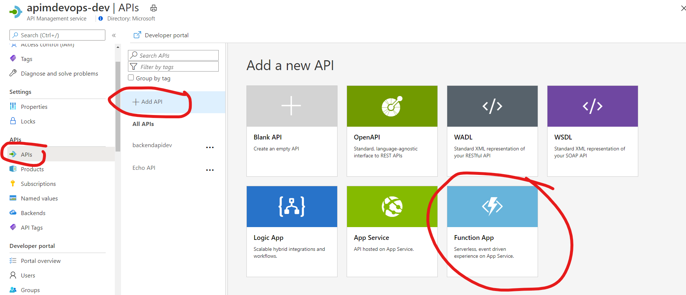
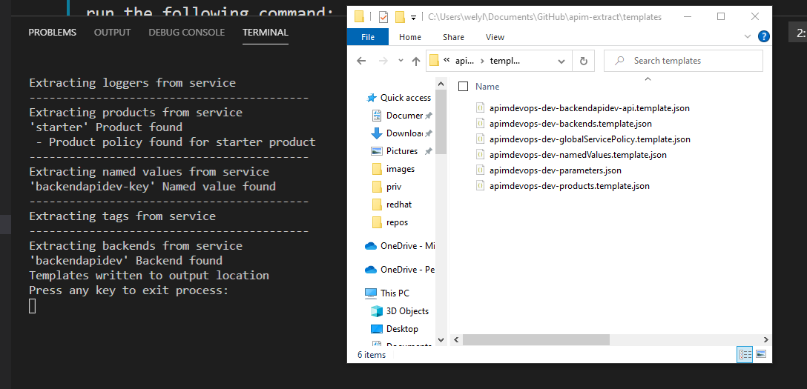

## 1. Basic: with two APIM instances, without PR (pull request)
Here's the architecture diagram

## Step 0) Prerequisites
The following Azure resources need to be provisioned before the following walkthru:
* Azure Function (Dev instance)
* Azure Function (Prod instance)
* Azure API Mgt (Dev instance)
* Azure API Mgt (Prod instance)
* Azure DevOps
* [Azure APIM DevOps Resource Kit](https://github.com/Azure/azure-api-management-devops-resource-kit), in particular the [Extractor](https://github.com/Azure/azure-api-management-devops-resource-kit/tree/master/src/APIM_ARMTemplate#Extractor)

## Step 1) This illustrates a API developer who is using VS Code to develop the backend apis. 

a) The backend api is developed with .NET Core and Azure Functions. Nothing fancy, just a plain "Hello function" as the backend api. The apis are stored in git repository, in this example it's on Azure Repos. 

b) The CI (Continuous Integration)
This part is done in Pipelines menu in Azure Pipelines. 

As soon as there's any new commit to the Azure Repos (Backend API Code), it will automatically trigger a build which eventually compile the .NET Core app and place the artifact the drop folder. To simplify the experience, you can choose the classic UI editor and enter "function", choose "Azure Function for .NET" as the job template, as can be seen from the diagram:

Here's the screenshot of CI in Azure DevOps with classic UI editor (though you can use yaml as well):

Make sure you check the Enable continous integration checkbox in the Trigger menu:

c) The CD (Continuous Deployment)
We then configure the CD in the Release menu of Azure Pipelines. 

My CD pipeline is as the following. 

The first step is to deploy to Dev instance of Azure Function. The task is as following:

We then added the second stage. But because it's for deploying to the production environment. We ensure it requires additional (manual) approval from team lead or user. As can be seen, you can define the pre-deployment condition as following:

The task of Deploy to Production stage is exactly the same with the Deploy to Dev Function, except targetting to production instance of Azure Function.

## Step 2) API publisher to setup and configure APIM
The next typical step is for API publisher to configure the APIM instance, including to add the backend api to the Dev instance of APIM, defining policy, products, etc. And most people perform this thru Azure Portal.

In this example, we just simply add the API from the Azure Function. Then simply browse the Dev Azure Function

You may test your API to ensure that it correctly connected to the backend.

## Step 3) Extract the templates
What we want to do next is to extract the templates in particular the changes we made thru the Portal during Step 2 so that it can be applied later on the Production Instance.

To do that, we will be using the Extractor tool as part of the Azure APIM DevOps Resource Kit. 

To do that, clone [this project](https://github.com/Azure/azure-api-management-devops-resource-kit) to your local machine, then navigate to the **azure-api-management-devops-resource-kit/src/APIM_ARMTemplate/** directory and run the following command:

**dotnet run extract --sourceApimName apimdevops-dev --destinationApimName apimdevops-prod --resourceGroup apim-devops-dev-rg --fileFolder c:\temp\apim-extract --apiName backendapidev**

Feel free to check out the documentation of the Extractor for more details [here](https://github.com/wely/azure-api-management-devops-resource-kit/tree/master/src/APIM_ARMTemplate#Extractor).

Verify if the extractor output the right files successfully on the directory that you specified earlier.

## Step 4) Using  Azure Pipelines to apply change in Azure APIM Production Instance
The next step is to setup Azure Pipelines which will be used to perform configuration and template changes on the Azure API Management Production Instance.

a) Preparing the Repo for the json template files.

We will also use Azure Repos to store the template (json files). However make sure that you create a new Repo, not to mixed with the Backend API one.

b) Setup CI as the validation

Next, we will setup our CI in the Pipeline section, and add the following tasks:

.

Here's the [yaml file](images/build-apim-instance.yml) that i've exported.

As can be seen in the yaml, the first step is to copy the file from Azure Repos to Azure Blob Storage. The second step is to perform the validation with Azure Template Deployment. And finally to publish the artifact to the drop-dev directory. 

c) Setup CD as the deployment
The actual deployment takes place in this step once the validation has been successfully done as part of the CI (build step above).

Similar to step 1, this is also done in the Releases menu under the Pipelines. Remember to also enable the trigger of the continuous deployment. 

There is only one Stage including 1 task underneath, which is the same with the build step,  the ARM Template deployment, but change the Deployment mode to "Incremental"

.

Alright, you are all set, feel free to perform an end-to-end test to see if it works.